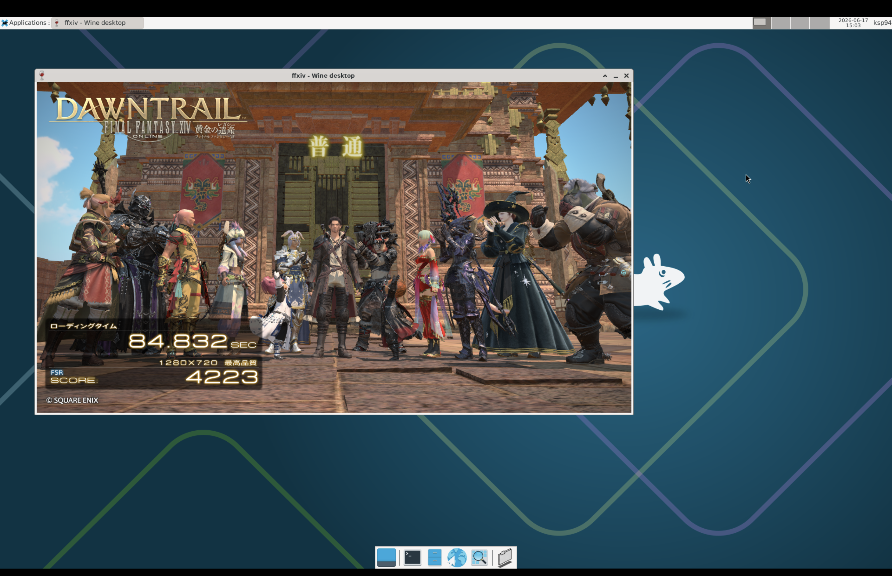

<p align="left">
  
</p>

# varmint
A small Virtual Machine Manager for Apple Silicon, built on top of Hypervisor.framework.

It boots a Debian arm64 guest and a small set of devices:
- virtio-blk
- virtio-net
- virtio-input
- virtio-snd
- virtio-gpu
- virtio-console (shared clipboard)

## Graphics
The main experiment is hardware-accelerated graphics.

Supported paths:
- Vulkan: `guest Vulkan => Mesa Venus => virglrenderer => MoltenVK => Metal`
- OpenGL: `guest OpenGL => Mesa VirGL => virglrenderer => ANGLE => Metal`

x86-64 binaries can run under FEX. Steam starts, Helltaker launches through Proton, and Wine/DXVK experiments are starting to work.

## Demo
Final Fantasy XIV Dawntrail benchmark:
<p align="left">
  
</p>

##  Setup
### Dependencies
```sh
chmod +x ./scripts/build_graphics_stack.sh ; ./scripts/build_graphics_stack.sh
```

## Resources
- [Booting AArch64 Linux](https://docs.kernel.org/arch/arm64/booting.html)
- [VIRTIO](https://docs.oasis-open.org/virtio/virtio/v1.3/csd01/virtio-v1.3-csd01.html)