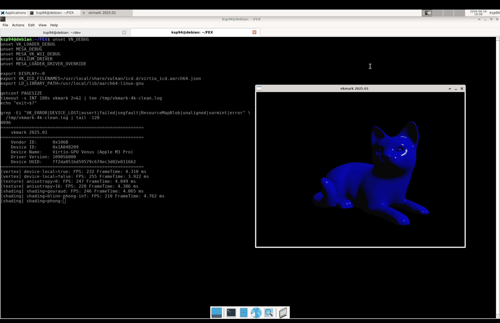

<p align="left">
  
</p>

# varmint
varmint – a tiny Virtual Machine Manager for Apple Silicon, built on top of the Hypervisor framework.

It can boot a Debian ARM64 guest with:
- virtio-blk
- virtio-net
- virtio-input
- virtio-snd
- virtio-gpu

Native guest Vulkan acceleration is currently experimental: Venus works well enough to run vkcube and vkmark through MoltenVK,
while x86 Vulkan, Wine, Proton, and DXVK are not supported yet.

<p align="left">
  
</p>

##  Setup
### Dependencies
```sh
# virglrenderer
brew tap libkrun/krun ; brew install libkrun/krun/virglrenderer

# MoltenVK
brew install molten-vk
```

## Resources
- [Booting AArch64 Linux](https://docs.kernel.org/arch/arm64/booting.html)
- [VIRTIO](https://docs.oasis-open.org/virtio/virtio/v1.3/csd01/virtio-v1.3-csd01.html)